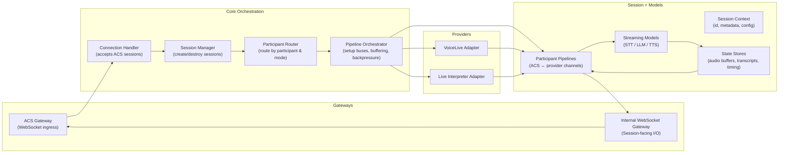

# Server Architecture Diagrams

Clean architecture layout for the server app focusing on gateways (ACS/WebSocket), core orchestration, providers (VoiceLive/Live Interpreter), and session + models. The Mermaid diagram is useful for quick reference, and the Draw.io XML can be imported directly into diagrams.net for visual editing.

## Mermaid


## Draw.io XML
Paste this XML into diagrams.net (File → Import) to view/edit the layout.

```xml
<mxfile host="app.diagrams.net" modified="2024-06-01T12:00:00.000Z" agent="5.0 (macOS)" version="21.6.0" editor="www.diagrams.net" type="device">
  <diagram name="Server Clean Architecture" id="server-architecture">
    <mxGraphModel dx="1200" dy="720" grid="1" gridSize="10" guides="1" tooltips="1" connect="1" arrows="1" fold="1" page="1" pageScale="1" pageWidth="1400" pageHeight="1000" background="#ffffff" math="0" shadow="0">
      <root>
        <mxCell id="0" />
        <mxCell id="1" parent="0" />

        <!-- Gateways -->
        <mxCell id="gw" value="Gateways" style="swimlane;fontStyle=1;align=center;verticalAlign=top;childLayout=stackLayout;horizontal=1;resizeParent=1;rounded=1;fillColor=#f5f5f5;strokeColor=#666666;" vertex="1" parent="1">
          <mxGeometry x="40" y="60" width="220" height="200" as="geometry" />
        </mxCell>
        <mxCell id="acs" value="ACS Gateway&#10;(WebSocket ingress)" style="rounded=1;whiteSpace=wrap;html=1;fillColor=#dae8fc;strokeColor=#6c8ebf;" vertex="1" parent="gw">
          <mxGeometry x="10" y="30" width="200" height="60" as="geometry" />
        </mxCell>
        <mxCell id="wsgw" value="Internal WebSocket Gateway&#10;(Session I/O)" style="rounded=1;whiteSpace=wrap;html=1;fillColor=#dae8fc;strokeColor=#6c8ebf;" vertex="1" parent="gw">
          <mxGeometry x="10" y="110" width="200" height="60" as="geometry" />
        </mxCell>

        <!-- Core Orchestration -->
        <mxCell id="core" value="Core Orchestration" style="swimlane;fontStyle=1;align=center;verticalAlign=top;childLayout=stackLayout;horizontal=1;resizeParent=1;rounded=1;fillColor=#f5f5f5;strokeColor=#666666;" vertex="1" parent="1">
          <mxGeometry x="300" y="40" width="260" height="340" as="geometry" />
        </mxCell>
        <mxCell id="conn" value="Connection Handler&#10;(accept ACS sessions)" style="rounded=1;whiteSpace=wrap;html=1;fillColor=#ffe6cc;strokeColor=#d79b00;" vertex="1" parent="core">
          <mxGeometry x="10" y="30" width="240" height="60" as="geometry" />
        </mxCell>
        <mxCell id="sm" value="Session Manager&#10;(create / destroy sessions)" style="rounded=1;whiteSpace=wrap;html=1;fillColor=#ffe6cc;strokeColor=#d79b00;" vertex="1" parent="core">
          <mxGeometry x="10" y="110" width="240" height="60" as="geometry" />
        </mxCell>
        <mxCell id="router" value="Participant Router&#10;(route by participant &amp; mode)" style="rounded=1;whiteSpace=wrap;html=1;fillColor=#ffe6cc;strokeColor=#d79b00;" vertex="1" parent="core">
          <mxGeometry x="10" y="190" width="240" height="60" as="geometry" />
        </mxCell>
        <mxCell id="pipeline" value="Pipeline Orchestrator&#10;(buses, buffering, backpressure)" style="rounded=1;whiteSpace=wrap;html=1;fillColor=#ffe6cc;strokeColor=#d79b00;" vertex="1" parent="core">
          <mxGeometry x="10" y="270" width="240" height="60" as="geometry" />
        </mxCell>

        <!-- Providers -->
        <mxCell id="providers" value="Providers" style="swimlane;fontStyle=1;align=center;verticalAlign=top;childLayout=stackLayout;horizontal=1;resizeParent=1;rounded=1;fillColor=#f5f5f5;strokeColor=#666666;" vertex="1" parent="1">
          <mxGeometry x="600" y="60" width="220" height="200" as="geometry" />
        </mxCell>
        <mxCell id="vl" value="VoiceLive Adapter" style="rounded=1;whiteSpace=wrap;html=1;fillColor=#d5e8d4;strokeColor=#82b366;" vertex="1" parent="providers">
          <mxGeometry x="10" y="30" width="200" height="60" as="geometry" />
        </mxCell>
        <mxCell id="li" value="Live Interpreter Adapter" style="rounded=1;whiteSpace=wrap;html=1;fillColor=#d5e8d4;strokeColor=#82b366;" vertex="1" parent="providers">
          <mxGeometry x="10" y="110" width="200" height="60" as="geometry" />
        </mxCell>

        <!-- Session + Models -->
        <mxCell id="session" value="Session + Models" style="swimlane;fontStyle=1;align=center;verticalAlign=top;childLayout=stackLayout;horizontal=1;resizeParent=1;rounded=1;fillColor=#f5f5f5;strokeColor=#666666;" vertex="1" parent="1">
          <mxGeometry x="870" y="40" width="260" height="340" as="geometry" />
        </mxCell>
        <mxCell id="context" value="Session Context&#10;(id, metadata, config)" style="rounded=1;whiteSpace=wrap;html=1;fillColor=#e1d5e7;strokeColor=#9673a6;" vertex="1" parent="session">
          <mxGeometry x="10" y="30" width="240" height="60" as="geometry" />
        </mxCell>
        <mxCell id="ppl" value="Participant Pipelines&#10;(ACS ↔ provider channels)" style="rounded=1;whiteSpace=wrap;html=1;fillColor=#e1d5e7;strokeColor=#9673a6;" vertex="1" parent="session">
          <mxGeometry x="10" y="110" width="240" height="60" as="geometry" />
        </mxCell>
        <mxCell id="models" value="Streaming Models&#10;(STT / LLM / TTS)" style="rounded=1;whiteSpace=wrap;html=1;fillColor=#e1d5e7;strokeColor=#9673a6;" vertex="1" parent="session">
          <mxGeometry x="10" y="190" width="240" height="60" as="geometry" />
        </mxCell>
        <mxCell id="state" value="State Stores&#10;(audio buffers, transcripts, timing)" style="rounded=1;whiteSpace=wrap;html=1;fillColor=#e1d5e7;strokeColor=#9673a6;" vertex="1" parent="session">
          <mxGeometry x="10" y="270" width="240" height="60" as="geometry" />
        </mxCell>

        <!-- Edges -->
        <mxCell id="e1" style="edgeStyle=orthogonalEdgeStyle;rounded=1;strokeColor=#666666;" edge="1" parent="1" source="acs" target="conn">
          <mxGeometry relative="1" as="geometry" />
        </mxCell>
        <mxCell id="e2" style="edgeStyle=orthogonalEdgeStyle;rounded=1;strokeColor=#666666;" edge="1" parent="1" source="conn" target="sm">
          <mxGeometry relative="1" as="geometry" />
        </mxCell>
        <mxCell id="e3" style="edgeStyle=orthogonalEdgeStyle;rounded=1;strokeColor=#666666;" edge="1" parent="1" source="sm" target="router">
          <mxGeometry relative="1" as="geometry" />
        </mxCell>
        <mxCell id="e4" style="edgeStyle=orthogonalEdgeStyle;rounded=1;strokeColor=#666666;" edge="1" parent="1" source="router" target="pipeline">
          <mxGeometry relative="1" as="geometry" />
        </mxCell>
        <mxCell id="e5" style="edgeStyle=orthogonalEdgeStyle;rounded=1;strokeColor=#666666;" edge="1" parent="1" source="pipeline" target="ppl">
          <mxGeometry relative="1" as="geometry" />
        </mxCell>
        <mxCell id="e6" style="edgeStyle=orthogonalEdgeStyle;rounded=1;strokeColor=#666666;" edge="1" parent="1" source="ppl" target="models">
          <mxGeometry relative="1" as="geometry" />
        </mxCell>
        <mxCell id="e7" style="edgeStyle=orthogonalEdgeStyle;rounded=1;strokeColor=#666666;" edge="1" parent="1" source="models" target="state">
          <mxGeometry relative="1" as="geometry" />
        </mxCell>
        <mxCell id="e8" style="edgeStyle=orthogonalEdgeStyle;rounded=1;strokeColor=#666666;" edge="1" parent="1" source="state" target="ppl">
          <mxGeometry relative="1" as="geometry" />
        </mxCell>
        <mxCell id="e9" style="edgeStyle=orthogonalEdgeStyle;rounded=1;strokeColor=#666666;" edge="1" parent="1" source="ppl" target="wsgw">
          <mxGeometry relative="1" as="geometry" />
        </mxCell>
        <mxCell id="e10" style="edgeStyle=orthogonalEdgeStyle;rounded=1;strokeColor=#666666;" edge="1" parent="1" source="wsgw" target="acs">
          <mxGeometry relative="1" as="geometry" />
        </mxCell>
        <mxCell id="e11" style="edgeStyle=orthogonalEdgeStyle;rounded=1;strokeColor=#666666;" edge="1" parent="1" source="pipeline" target="vl">
          <mxGeometry relative="1" as="geometry" />
        </mxCell>
        <mxCell id="e12" style="edgeStyle=orthogonalEdgeStyle;rounded=1;strokeColor=#666666;" edge="1" parent="1" source="pipeline" target="li">
          <mxGeometry relative="1" as="geometry" />
        </mxCell>
        <mxCell id="e13" style="edgeStyle=orthogonalEdgeStyle;rounded=1;strokeColor=#666666;" edge="1" parent="1" source="vl" target="ppl">
          <mxGeometry relative="1" as="geometry" />
        </mxCell>
        <mxCell id="e14" style="edgeStyle=orthogonalEdgeStyle;rounded=1;strokeColor=#666666;" edge="1" parent="1" source="li" target="ppl">
          <mxGeometry relative="1" as="geometry" />
        </mxCell>
      </root>
    </mxGraphModel>
  </diagram>
</mxfile>
```
